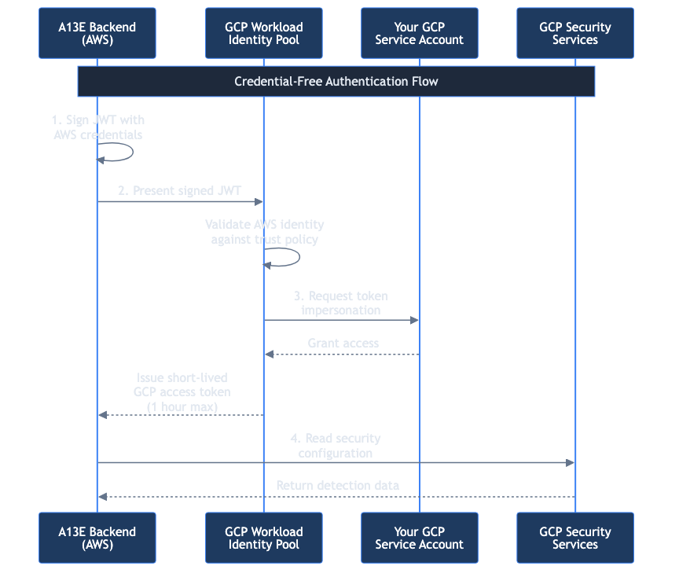

# Connecting GCP Accounts

Connect your Google Cloud Platform projects to A13E for security detection scanning using Workload Identity Federation.

## TL;DR

- A13E uses **Workload Identity Federation (WIF)** for keyless authentication—no service account keys to manage
- Requires creating a **WIF pool**, **AWS provider**, and **service account** with read-only permissions
- Choose **Terraform** (10 minutes) or **Manual gcloud** (15-20 minutes)
- A13E **cannot** modify resources, read log contents, or access secrets

---

## Why Workload Identity Federation?

A13E exclusively uses WIF for GCP—**we don't accept service account keys**. Here's why:

| Service Account Keys | Workload Identity Federation |
|---------------------|------------------------------|
| Long-lived credentials (never expire by default) | Short-lived tokens (1 hour max) |
| Must be rotated manually | Automatic credential rotation |
| Risk of key leakage | No keys to leak |
| Stored in your systems | Federated from A13E's AWS identity |

**WIF provides enterprise-grade security** by allowing A13E's AWS identity to securely impersonate a GCP service account without any shared secrets.

---

## Before You Start

You'll need:

- **GCP Console access**: Permission to create service accounts, IAM roles, and Workload Identity pools
- **GCP Project ID**: The project you want to scan
- **About 15 minutes**: For the complete setup process

During setup, A13E provides its **AWS Account ID**—this is used to configure the WIF trust relationship.

---

## Understanding Permissions

A13E uses **read-only permissions** following the principle of least privilege.

### What A13E Can Access

| Service | Permissions | Purpose |
|---------|-------------|---------|
| Security Command Center | Read findings and notifications | Discover SCC-based detections |
| Cloud Logging | Read log sinks and metrics | Find log-based alerting |
| Eventarc | Read triggers | Discover event-driven detections |
| Cloud Monitoring | Read alert policies | Find monitoring rules |
| Cloud Functions | List functions (metadata only) | Identify custom detections |
| Chronicle | Read detection rules (if enabled) | Map SIEM detections |
| IAM | Read service account info (self) | Validate connection |

### What A13E Cannot Access

- ❌ Billing or cost data
- ❌ Modify any resources
- ❌ Read actual log contents
- ❌ Access Secret Manager secrets
- ❌ Create or delete compute resources
- ❌ Access Cloud Storage object contents

---

## How WIF Works



*A13E's credential-free authentication using Workload Identity Federation. The AWS backend signs a JWT, GCP validates the identity, and issues a short-lived token (maximum 1 hour) to access your security configuration.*

1. A13E authenticates using its AWS IAM role
2. GCP's WIF pool validates the AWS identity against the configured trust
3. GCP issues a short-lived token to impersonate your service account
4. A13E uses this token to read your security configuration

---

## Connection Methods

| Method | Best For | Time |
|--------|----------|------|
| **Terraform** | Infrastructure-as-Code workflows | 10 minutes |
| **Manual (gcloud)** | Custom setups, strict change control | 15-20 minutes |

---

## Method 1: Terraform (Recommended)

### Step 1: Add Your Account in A13E

1. Navigate to **Accounts** in A13E
2. Click **Add Account**
3. Enter:
   - **Account Name**: Descriptive name (e.g., "Production GCP")
   - **Provider**: GCP
   - **Project ID**: Your GCP project ID
   - **Regions**: Select which regions to scan (or auto-discover)
4. Click **Add Account**

### Step 2: Start the Connection Wizard

1. Click the **Connect** button (link icon) on your new account
2. Review the permissions A13E will request
3. Click **Continue**
4. Note the **A13E AWS Account ID** displayed at the top

### Step 3: Download Terraform Module

1. Click **Terraform** to download the Terraform configuration
2. Save the file to your Terraform project

### Step 4: Apply the Configuration

```bash
# Navigate to where you saved the file
cd path/to/a13e-terraform

# Update variables in the .tf file or create a terraform.tfvars:
# a13e_aws_account_id = "FROM_WIZARD"
# project_id = "your-gcp-project-id"

# Initialise and apply
terraform init
terraform plan
terraform apply

# Get the service account email
terraform output service_account_email
```

### Step 5: Complete Connection in A13E

1. Return to the A13E connection wizard
2. Click **I've Created the Resources**
3. Enter:
   - **Service Account Email**: From Terraform output (e.g., `a13e-scanner@your-project.iam.gserviceaccount.com`)
   - **WIF Pool ID**: `a13e-pool` (default)
   - **WIF Provider ID**: `aws` (default)
4. Click **Continue**
5. Click **Validate Connection**
6. Wait for validation to complete
7. Click **Done**

---

## Method 2: Manual Setup (gcloud)

### Step 1: Start the Wizard

Follow Steps 1-2 from the Terraform method to add your account and start the connection wizard.

### Step 2: Create the Custom IAM Role

Create a role with minimal read-only permissions:

```bash
gcloud iam roles create a13e_scanner \
  --project=YOUR_PROJECT_ID \
  --title="A13E Detection Scanner" \
  --description="Read-only access for A13E security detection scanning" \
  --permissions=\
securitycenter.findings.list,\
securitycenter.notificationConfigs.list,\
logging.sinks.list,\
logging.logMetrics.list,\
eventarc.triggers.list,\
monitoring.alertPolicies.list,\
cloudfunctions.functions.list,\
iam.serviceAccounts.get
```

### Step 3: Create the Service Account

```bash
gcloud iam service-accounts create a13e-scanner \
  --project=YOUR_PROJECT_ID \
  --display-name="A13E Scanner Service Account" \
  --description="Used by A13E for security detection scanning"
```

### Step 4: Grant the Role

```bash
gcloud projects add-iam-policy-binding YOUR_PROJECT_ID \
  --member="serviceAccount:a13e-scanner@YOUR_PROJECT_ID.iam.gserviceaccount.com" \
  --role="projects/YOUR_PROJECT_ID/roles/a13e_scanner"
```

### Step 5: Create the Workload Identity Pool

```bash
gcloud iam workload-identity-pools create a13e-pool \
  --project=YOUR_PROJECT_ID \
  --location=global \
  --display-name="A13E Workload Identity Pool" \
  --description="Allows A13E to authenticate from AWS"
```

### Step 6: Add the AWS Provider

Replace `A13E_AWS_ACCOUNT_ID` with the value from the wizard:

```bash
gcloud iam workload-identity-pools providers create-aws aws \
  --project=YOUR_PROJECT_ID \
  --location=global \
  --workload-identity-pool=a13e-pool \
  --account-id=A13E_AWS_ACCOUNT_ID \
  --display-name="A13E AWS Provider"
```

### Step 7: Grant WIF Access to Service Account

```bash
gcloud iam service-accounts add-iam-policy-binding \
  a13e-scanner@YOUR_PROJECT_ID.iam.gserviceaccount.com \
  --project=YOUR_PROJECT_ID \
  --role="roles/iam.workloadIdentityUser" \
  --member="principalSet://iam.googleapis.com/projects/PROJECT_NUMBER/locations/global/workloadIdentityPools/a13e-pool/attribute.aws_account/A13E_AWS_ACCOUNT_ID"
```

> **Note**: Replace `PROJECT_NUMBER` with your GCP project number (found in Cloud Console under Project info).

### Step 8: Complete Connection in A13E

1. Return to the A13E connection wizard
2. Click **I've Created the Resources**
3. Enter:
   - **Service Account Email**: `a13e-scanner@YOUR_PROJECT_ID.iam.gserviceaccount.com`
   - **WIF Pool ID**: `a13e-pool`
   - **WIF Provider ID**: `aws`
4. Click **Validate Connection**
5. Click **Done** when validation succeeds

---

## Validating Your Connection

When you click **Validate Connection**, A13E:

1. Uses WIF to obtain a short-lived GCP access token
2. Tests each required permission
3. Reports success or failure for each service

### Successful Validation

You'll see green checkmarks for:
- ✓ Security Command Center access
- ✓ Cloud Logging access
- ✓ Eventarc access
- ✓ Cloud Monitoring access
- ✓ Cloud Functions access

### Failed Validation

| Error | Cause | Solution |
|-------|-------|----------|
| **Token exchange failed** | WIF misconfigured | Verify pool and provider IDs match |
| **Permission denied** | Missing IAM bindings | Check service account has the custom role |
| **Service account not found** | Wrong email | Verify service account email format |
| **Invalid principal** | AWS account ID mismatch | Check the A13E AWS Account ID in provider config |

---

## Troubleshooting

### "Token Exchange Failed" Error

The WIF pool or provider may be misconfigured:

1. Verify the WIF pool exists:
   ```bash
   gcloud iam workload-identity-pools describe a13e-pool \
     --location=global --project=YOUR_PROJECT_ID
   ```

2. Verify the AWS provider exists:
   ```bash
   gcloud iam workload-identity-pools providers describe aws \
     --workload-identity-pool=a13e-pool \
     --location=global --project=YOUR_PROJECT_ID
   ```

3. Check the AWS account ID matches A13E's account ID from the wizard

### "Permission Denied" Error

The service account may be missing permissions:

1. List the service account's roles:
   ```bash
   gcloud projects get-iam-policy YOUR_PROJECT_ID \
     --filter="bindings.members:a13e-scanner@YOUR_PROJECT_ID.iam.gserviceaccount.com" \
     --flatten="bindings[].members" --format="table(bindings.role)"
   ```

2. Verify the custom role has all required permissions:
   ```bash
   gcloud iam roles describe a13e_scanner --project=YOUR_PROJECT_ID
   ```

### "Workload Identity User" Missing

The WIF pool needs permission to impersonate the service account:

```bash
# Check existing bindings
gcloud iam service-accounts get-iam-policy \
  a13e-scanner@YOUR_PROJECT_ID.iam.gserviceaccount.com

# Add the binding if missing (see Step 7 in Manual Setup)
```

---

## Multi-Project Setup

### Organisation-Level Scanning (Pro+)

For organisations with many projects, use organisation-level service accounts:

1. Create the service account at the organisation level
2. Grant organisation-wide read permissions
3. Configure a single WIF pool for all projects

Contact support@a13e.com for organisation-level scanning setup assistance.

### Separate Projects

For individual project scanning:

1. Add each project as a separate account in A13E
2. Complete the WIF setup in each project
3. Coverage analysis aggregates results across all projects

---

## Security Considerations

### Keyless Authentication

WIF eliminates service account key risks:

- **No keys to rotate**: Credentials are automatically short-lived
- **No key storage**: Nothing to encrypt or protect
- **Auditable access**: All token exchanges logged in Cloud Audit Logs

### Minimal Permissions

The custom role grants only read access:

- Cannot modify resources
- Cannot access data contents
- Cannot assume other identities

### Audit Trail

All A13E API calls are logged in Cloud Audit Logs. Filter by the service account principal to see exactly what A13E accesses.

---

## GCP Services Scanned

A13E discovers detections from:

| Service | Detection Type | What's Discovered |
|---------|----------------|-------------------|
| **Security Command Center** | SCC findings | Managed threat detection, vulnerability findings |
| **Cloud Logging** | Log-based alerts | Log sinks with alerting policies |
| **Eventarc** | Event triggers | Audit log-based event routing |
| **Cloud Monitoring** | Alert policies | Metric-based monitoring rules |
| **Cloud Functions** | Custom detections | Functions triggered by security events |
| **Chronicle** | SIEM rules | Detection rules (if Chronicle is enabled) |

---

## Next Steps

- [Running Scans](./running-scans.md) - Start scanning for detection coverage
- [Understanding Coverage](./understanding-coverage.md) - Interpret your results
- [Connecting AWS Accounts](./connecting-aws-accounts.md) - Add AWS accounts too
