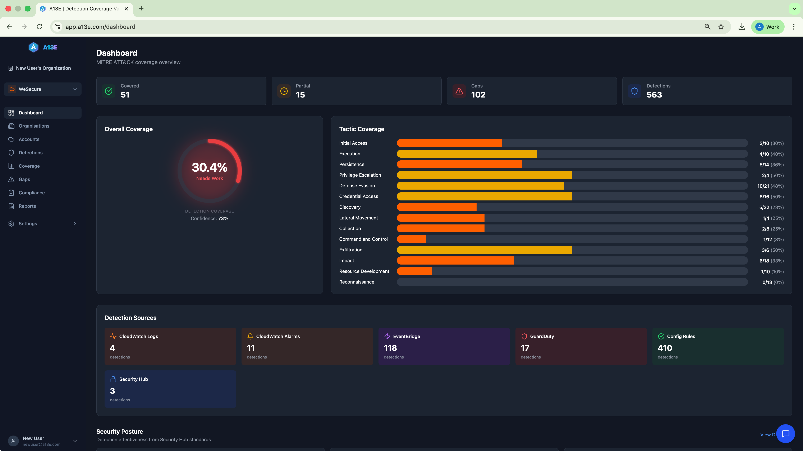

# Running Scans

Learn how to scan your cloud accounts to discover security detections and calculate MITRE ATT&CK coverage.

## TL;DR

- **Scans discover** security detections from GuardDuty, Security Hub, EventBridge, CloudWatch, and Config Rules
- **Typical duration**: 5-15 minutes depending on account size and regions
- **Schedule scans** for automatic weekly or daily coverage updates
- **Free tier**: Limited scans per week. Paid plans: Unlimited scans

---

## What is a Scan?

A scan is the process where A13E:

1. **Connects** to your cloud account using the configured credentials
2. **Discovers** security detections across multiple AWS services
3. **Maps** each detection to MITRE ATT&CK techniques
4. **Calculates** your coverage percentage and identifies gaps
5. **Generates** prioritised recommendations

### What Gets Scanned

**AWS Services:**

| Service | What A13E Discovers |
|---------|---------------------|
| **GuardDuty** | Threat detection finding types and configurations |
| **Security Hub** | Enabled security standards and control statuses |
| **EventBridge** | Custom rules monitoring CloudTrail events |
| **CloudWatch Logs** | Insights queries and metric filters with alarms |
| **CloudWatch Alarms** | Metric alarms and their current state |
| **Config Rules** | Managed and custom compliance rules |
| **Inspector** | Vulnerability findings |
| **Macie** | Sensitive data findings |

**GCP Services:**

| Service | What A13E Discovers |
|---------|---------------------|
| **Security Command Center** | Threat findings and notification configs |
| **Cloud Logging** | Log sinks and log-based metrics |
| **Eventarc** | Event triggers monitoring audit logs |
| **Cloud Monitoring** | Alert policies and notification channels |
| **Cloud Functions** | Functions triggered by security events |
| **Chronicle** | SIEM detection rules (if enabled) |

### Scan Duration

Typical scan times based on account complexity:

| Account Size | Detections | Duration |
|--------------|------------|----------|
| Small | 1-50 | 2-5 minutes |
| Medium | 50-200 | 5-10 minutes |
| Large | 200+ | 10-20 minutes |

Factors affecting duration:
- Number of regions configured for scanning
- Volume of EventBridge rules and Config rules
- AWS API rate limits in your account

---

## Running a Manual Scan

### Before You Start

Ensure your account is ready:

- ✓ Cloud account added to A13E
- ✓ Credentials connected and validated
- ✓ Status shows "Connected" (green badge)

### Starting a Scan

1. Navigate to **Accounts** in the main menu
2. Find the account you want to scan
3. Click the **Play** button (▶) on the account card
4. Watch the progress bar as the scan runs

### Monitoring Progress

While scanning, you'll see:

- **Progress bar**: Visual indicator of completion percentage
- **Current step**: What A13E is currently scanning (e.g., "Scanning GuardDuty...")
- **Status badge**: Changes from "Connected" to "Scanning..."

### Scan Status Values

| Status | Description |
|--------|-------------|
| **Pending** | Scan queued, waiting to start |
| **Running** | Currently scanning the cloud account |
| **Completed** | Scan finished successfully |
| **Failed** | Scan encountered an error |

---

## Detection Sources Explained

### GuardDuty Findings

**What it scans**: Active GuardDuty detector configuration and finding types.

**Example detections**:
- `UnauthorizedAccess:IAMUser/InstanceCredentialExfiltration`
- `Backdoor:EC2/C2ActivityB.DNS`
- `CryptoCurrency:EC2/BitcoinTool.B!DNS`

**MITRE mappings**: Credential Access, Command and Control, Impact

### Security Hub Controls

**What it scans**: Enabled security standards (AWS Foundational, CIS, PCI-DSS) and control compliance status.

**Example detections**:
- `CloudTrail.1 - CloudTrail should be enabled`
- `IAM.1 - IAM policies should not allow full administrative privileges`
- `S3.1 - S3 Block Public Access setting should be enabled`

**MITRE mappings**: Defence Evasion, Persistence, Privilege Escalation

### EventBridge Rules

**What it scans**: Custom EventBridge rules that monitor CloudTrail events.

**Example detections**:
- Rules monitoring `CreateUser`, `DeleteUser` IAM events
- Rules tracking EC2 instance state changes
- Rules detecting S3 bucket policy modifications

**MITRE mappings**: Based on the CloudTrail events being monitored

### CloudWatch Logs Insights

**What it scans**: Saved Insights queries and metric filters connected to alarms.

**Example detections**:
- Queries searching for failed authentication attempts
- Filters detecting unauthorised API calls
- Queries identifying unusual network traffic patterns

**MITRE mappings**: Based on what the query or filter is designed to detect

### CloudWatch Alarms

**What it scans**: Metric alarms and their current state (OK, ALARM, INSUFFICIENT_DATA).

**Why it matters**: Alarms indicate active monitoring and alerting capability.

### Config Rules

**What it scans**: Managed and custom Config rules with compliance evaluation status.

**Example detections**:
- `encrypted-volumes` - Check if EBS volumes are encrypted
- `root-account-mfa-enabled` - Verify MFA on root account
- `s3-bucket-logging-enabled` - Ensure S3 logging is active

**MITRE mappings**: Defence Evasion, Collection

---

## Scheduled Scans

> **Available in**: Individual, Pro, and Enterprise plans

Automate your scans to track coverage over time without manual intervention.

### Creating a Schedule

1. Navigate to **Accounts**
2. Click the **Calendar** icon on the account you want to schedule
3. Configure the schedule:
   - **Frequency**: Daily, Weekly, or Monthly
   - **Day/Time**: When to run (in your local timezone)
4. Click **Save Schedule**

### Frequency Recommendations

| Frequency | Best For |
|-----------|----------|
| **Daily** | Active detection development, production environments |
| **Weekly** | Standard monitoring, most organisations |
| **Monthly** | Stable environments, quarterly reviews |

### Managing Schedules

View scheduled scans via the calendar icon on each account card:

- **Edit**: Change frequency or timing
- **Pause**: Temporarily disable without deleting
- **Delete**: Remove the schedule entirely

A scheduled account shows a badge indicating the next scan time.

---

## Scan Limits

### Free Plan

The Free plan includes limited scans per week:

- **Weekly limit**: Check the Dashboard for your current usage
- **Resets**: Weekly on a rolling basis
- **Upgrade**: Go to **Settings** → **Billing** for unlimited scans

When you've reached your limit:
- The Play button becomes disabled
- A banner shows when your limit resets
- Scheduled scans are paused until the limit resets

### Paid Plans

Individual, Pro, and Enterprise plans include **unlimited scans**.

---

## After the Scan

### Scan Completion

When a scan completes successfully:

1. A green notification appears: "Scan completed! Found X detections."
2. The account card updates with:
   - **Last scan**: Timestamp of the completed scan
   - **Status**: Returns to "Connected"

### Viewing Results

Your scan results appear across multiple pages:

| Page | What to Check |
|------|---------------|
| **Dashboard** | Quick overview of coverage percentage and top gaps |
| **Coverage** | Full MITRE ATT&CK heatmap with technique details |
| **Detections** | Browse all discovered detections |
| **Gaps** | Prioritised list of coverage gaps with remediation |
| **Compliance** | Framework coverage (CIS, NIST 800-53) |

### Coverage Metrics

After each scan, A13E calculates:

| Metric | Description |
|--------|-------------|
| **Coverage %** | Percentage of techniques with strong detection (≥60% confidence) |
| **Covered** | Techniques with ≥60% confidence |
| **Partial** | Techniques with 40-60% confidence |
| **Uncovered** | Techniques with <40% confidence |
| **Total Detections** | Number of security detections discovered |
| **Mapped Detections** | Detections successfully mapped to MITRE techniques |

---

## Troubleshooting

### Scan Failed

If a scan fails:

1. **Check credentials**: Verify the connection is still valid
   - Click the **Settings** icon on the account
   - Click **Validate Connection**
2. **Review permissions**: Ensure the IAM role has all required permissions
3. **Check AWS status**: Verify no AWS service outages in your regions
4. **Retry**: Click the **Play** button to start a new scan

### Scan Takes Too Long

Scans may take longer if:

- You have many regions configured
- Your account has thousands of EventBridge rules
- AWS API rate limiting is occurring

Consider:
- Reducing the number of regions (scan only where you have resources)
- Running scans during off-peak hours

### No Detections Found

If a scan finds no detections:

1. Verify security services are enabled (GuardDuty, Security Hub, etc.)
2. Check that the IAM role has read permissions for all services
3. Confirm you're scanning the correct regions

### Credentials Expired

If you see "Connection Error" or "Expired":

1. Click the **Connect** button on the account
2. Create a new IAM role or update the existing one
3. Enter the new Role ARN
4. Validate the connection

---

## Best Practices

### Scanning Frequency

| Stage | Recommendation |
|-------|----------------|
| **Initial setup** | Run 2-3 scans to establish baseline |
| **Active development** | Daily or weekly scans |
| **Steady state** | Weekly scans |
| **Compliance reporting** | Before each audit period |

### Regional Coverage

- **Scan active regions**: Include all regions where you have resources
- **Include sparse regions**: Even minimal resources can have security gaps
- **Exclude unused regions**: Reduce scan time by excluding truly empty regions

### After Scans

After each scan:

1. ✓ Review coverage changes from the previous scan
2. ✓ Check for new gaps (especially Critical and High priority)
3. ✓ Investigate any removed detections (were they disabled?)
4. ✓ Export reports for compliance documentation

---

## Next Steps

- [Using the Dashboards](./using-dashboards.md) - Interpret your scan results
- [Understanding Coverage](./understanding-coverage.md) - Learn about MITRE ATT&CK mapping
- [Connecting AWS Accounts](./connecting-aws-accounts.md) - Add AWS accounts
- [Connecting GCP Accounts](./connecting-gcp-accounts.md) - Add GCP projects
