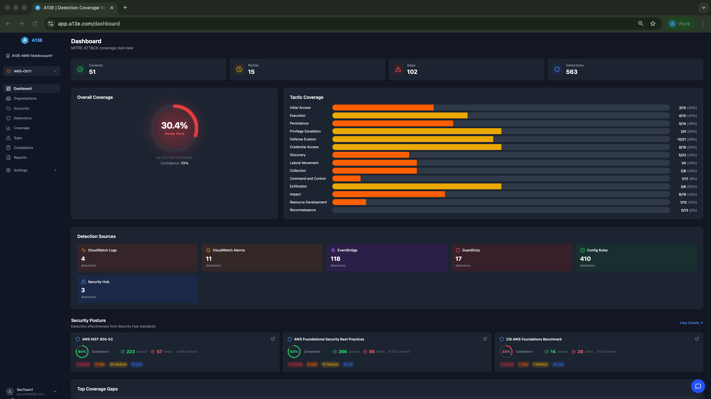
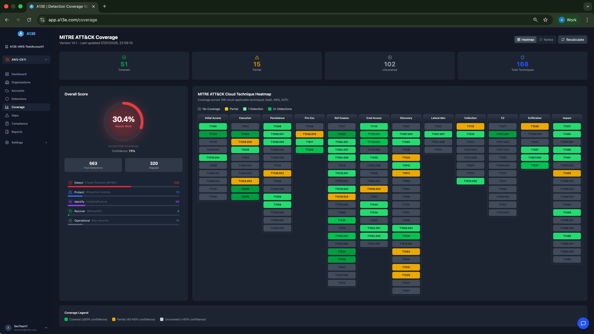
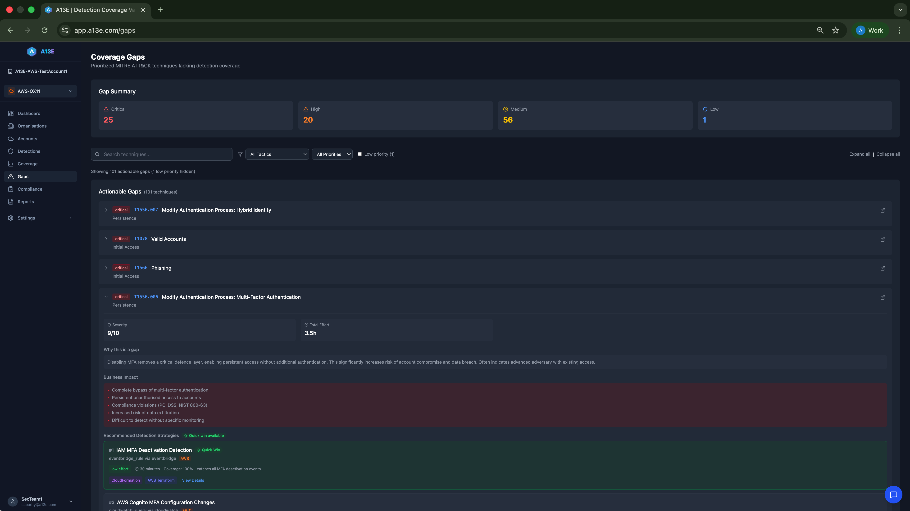
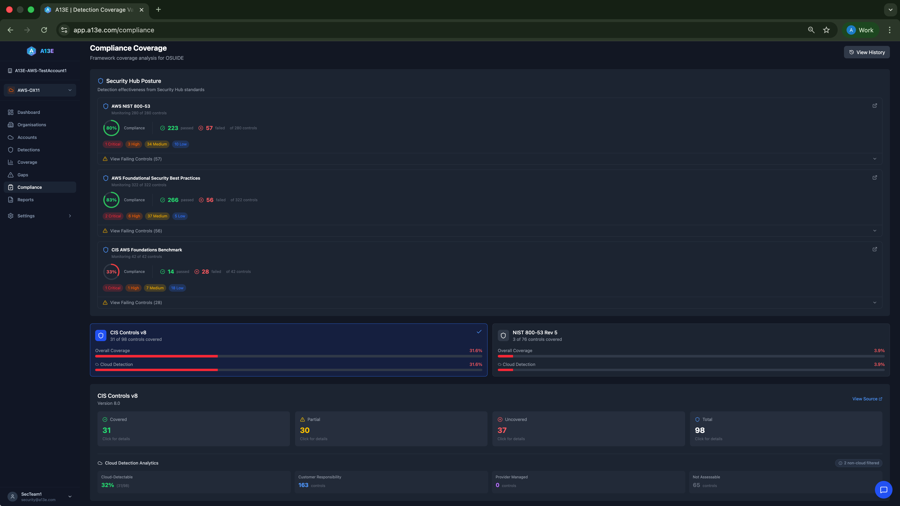

# Using the Dashboards

Navigate A13E's dashboards to understand your security detection coverage and identify areas for improvement.

## TL;DR

- **Dashboard**: High-level overview with coverage gauge, tactic heatmap, and top gaps
- **Coverage**: Full MITRE ATT&CK heatmap showing all 168 cloud techniques
- **Detections**: Browse and filter all discovered security detections
- **Gaps**: Prioritised coverage gaps with remediation guidance and IaC templates
- **Compliance**: CIS Controls and NIST 800-53 framework coverage

---

## Dashboard

The Dashboard provides a quick overview of your security detection coverage.

### Account Selector

If you have multiple cloud accounts, use the account selector in the top navigation to switch between them. All dashboard data updates to reflect the selected account.

### Summary Statistics

Four metric cards show your current coverage status at a glance:

| Card | Meaning |
|------|---------|
| **Covered** | Techniques with strong detection (≥60% confidence) |
| **Partial** | Techniques with moderate detection (40-60% confidence) |
| **Gaps** | Techniques with little or no detection (<40% confidence) |
| **Detections** | Total security detections discovered |

### Coverage Gauge

The circular gauge shows:

- **Coverage percentage**: Your overall detection coverage (larger number)
- **Average confidence**: Mean confidence score across all techniques (smaller number)

**What's a good score?**

| Coverage | Assessment |
|----------|------------|
| 80%+ | Excellent |
| 60-80% | Good |
| 40-60% | Fair |
| <40% | Needs attention |

### Tactic Heatmap

A horizontal bar chart showing coverage across the 14 MITRE ATT&CK tactics:

- **Green bars**: Well covered tactics
- **Yellow bars**: Partially covered tactics
- **Grey bars**: Under-covered tactics

Click any tactic bar to navigate to the Coverage page filtered to that tactic.

### Detection Sources

Cards showing how many detections were discovered from each AWS service:

| Source | Icon Colour | Description |
|--------|-------------|-------------|
| **CloudWatch Logs** | Orange | Log Insights queries and metric filters |
| **CloudWatch Alarms** | Amber | Metric alarms |
| **EventBridge** | Purple | Custom CloudTrail monitoring rules |
| **GuardDuty** | Red | Managed threat detection |
| **Config Rules** | Green | Compliance rules |
| **Security Hub** | Blue | Security standards and controls |

Cards show "not configured" if no detections were found for that source.

### Security Posture

Shows detection effectiveness from your Security Hub standards:

- **Passed controls**: Controls in compliant state
- **Failed controls**: Controls requiring attention
- **Score**: Overall security posture percentage

Click **View Details →** to go to the Compliance page.

### Top Coverage Gaps

A preview of your 5 most critical coverage gaps, showing:

- **Technique ID**: The MITRE ATT&CK technique (e.g., T1078.004)
- **Technique name**: Human-readable name
- **Tactic**: The attack stage this technique belongs to
- **Priority**: Critical, High, Medium, or Low

Click **View all gaps →** to see the complete gap analysis.

### Scan Limits (Free Plan)

If you're on the Free plan, a card shows:

- **Scans used**: How many scans you've run this week
- **Scans remaining**: How many more you can run
- **Reset date**: When your weekly limit resets

Click **Upgrade for unlimited scans →** to view paid plans.

---

## Coverage Page

The Coverage page provides a detailed view of your MITRE ATT&CK detection coverage.

### Page Header

- **MITRE Version**: The ATT&CK framework version being used
- **Last updated**: When coverage was last calculated
- **View toggle**: Switch between Heatmap and Tactics views
- **Refresh button**: Recalculate coverage from latest scan data

### Summary Cards (Clickable)

Four cards showing technique counts by status:

| Card | Icon | What it shows |
|------|------|---------------|
| **Covered** | Green checkmark | Techniques with ≥60% confidence |
| **Partial** | Yellow triangle | Techniques with 40-60% confidence |
| **Uncovered** | Grey X | Techniques with <40% confidence |
| **Total** | Blue shield | All 168 cloud techniques |

**Click any card** to open a modal showing all techniques in that category.

### Overall Score Panel

Shows your coverage metrics:

- **Coverage gauge**: Visual percentage indicator
- **Total Detections**: All discovered detections
- **Mapped**: Detections successfully mapped to MITRE techniques
- **Security Function Breakdown**: Distribution across Protect, Detect, Respond functions

### MITRE ATT&CK Heatmap

The main visualisation showing all 168 cloud-applicable techniques organised by tactic.

**Reading the heatmap**:
- **Columns**: 14 tactics (attack stages, left to right)
- **Rows**: Individual techniques within each tactic
- **Cells**: One cell per technique

**Colour coding**:

| Colour | Confidence | Meaning |
|--------|------------|---------|
| **Dark green** | 80-100% | Excellent coverage |
| **Light green** | 60-79% | Good coverage |
| **Yellow** | 40-59% | Partial coverage |
| **Light grey** | 20-39% | Minimal coverage |
| **Dark grey** | <20% | No coverage |

**Interacting with the heatmap**:
- **Hover** over any cell to see technique details
- **Click** a cell to view full technique information and mapped detections

### Tactics View

An alternative view showing a bar chart of coverage by tactic. Best for:
- Comparing coverage across attack stages
- Identifying which tactics need the most attention
- Quick summary for presentations

### Coverage Legend

Reference for colour coding:
- **Green**: Covered (≥60% confidence)
- **Yellow**: Partial (40-60% confidence)
- **Grey**: Uncovered (<40% confidence)

---

## Detections Page

Browse and search all security detections discovered in your cloud accounts.

### Search and Filters

- **Search box**: Find detections by name
- **Type filter**: Filter by source (GuardDuty, Security Hub, EventBridge, etc.)
- **Status filter**: Filter by status (active, disabled)
- **Clear filters**: Reset all filters

### Results Count

Shows "Showing X of Y detections" plus count of Security Hub standards if applicable.

### Security Hub Standards

If you have Security Hub enabled, aggregated standard cards appear at the top:

- **Standard name**: e.g., "AWS Foundational Security Best Practices"
- **Enabled controls**: How many controls are active
- **Detection effectiveness**: Pass/fail breakdown
- **Region**: Which region this standard is from

Click a standard card to see detailed control information.

### Detections Table

All individual detections in a sortable table:

| Column | Description |
|--------|-------------|
| **Detection** | Name of the detection rule |
| **Type** | Source service (GuardDuty, EventBridge, etc.) |
| **Region** | AWS region where detected |
| **Status** | Active or disabled |
| **Compliance** | Compliant, Non-compliant, or N/A |
| **Mappings** | Number of MITRE techniques this detection covers |
| **Discovered** | When A13E first found this detection |

**Sorting**: Click any column header to sort. Click again to reverse.

**Details**: Click any row to open the detection detail modal showing:
- Full detection configuration
- All mapped MITRE techniques
- Confidence scores for each mapping

---

## Gaps Page

View and manage your coverage gaps with prioritised remediation guidance.

### Gap Summary

Four cards showing gap counts by priority:

| Priority | Colour | What it means |
|----------|--------|---------------|
| **Critical** | Red | Address immediately—high-impact techniques |
| **High** | Orange | Plan remediation soon |
| **Medium** | Yellow | Schedule for review |
| **Low** | Blue | Monitor but lower priority |

Click any card to filter the gap list to that priority.

### Filters and Controls

- **Search**: Find gaps by technique name or ID
- **Tactic filter**: Show gaps from a specific tactic
- **Priority filter**: Show gaps of a specific priority
- **Show low priority**: Toggle to include low-priority gaps (hidden by default)
- **Show acknowledged**: Toggle to see gaps you've marked as acknowledged
- **Expand/Collapse all**: Expand or collapse all gap details

### Gap Cards

Each gap shows:

**Header (always visible)**:
- Priority badge (Critical, High, Medium, Low)
- Technique ID (e.g., T1078.004)
- Technique name
- Tactic name
- Link to MITRE ATT&CK documentation

**Expanded details** (click to expand):

- **Threat context**: Severity score, estimated effort, known threat actors
- **Why this is a gap**: Explanation of missing coverage
- **Business impact**: Potential consequences if exploited
- **Recommended data sources**: AWS services needed for detection
- **Detection strategies**: Specific approaches with effort levels
- **Quick wins**: Low-effort strategies marked with a lightning bolt

### Remediation Templates

For gaps with templates available, you'll see buttons to view:

- **Query Available**: Detection query or rule logic
- **CloudFormation**: AWS CloudFormation template
- **AWS Terraform**: Terraform configuration for AWS
- **GCP Query**: Detection query for GCP
- **GCP Terraform**: Terraform configuration for GCP

Click any button to open the strategy detail modal with copyable code.

### Acknowledging Gaps

If you've decided to accept a gap (compensating controls, not applicable, etc.):

1. Expand the gap
2. Click **Mark as Acknowledged**
3. The gap moves to the acknowledged section

To reopen an acknowledged gap, toggle **Show acknowledged** and click **Reopen**.

---

## Compliance Page

View your coverage against compliance frameworks.

### Framework Overview

Shows coverage across supported frameworks:

- **CIS Controls v8**: Centre for Internet Security Controls
- **NIST 800-53 Rev 5**: Federal security controls

Each framework card shows:
- Total controls in the framework
- Controls covered by your detections
- Coverage percentage

### Framework Details

Click a framework to see:

- **Control families**: Groups of related controls
- **Individual controls**: Specific requirements
- **Covered/Partial/Uncovered status**: For each control
- **Mapped detections**: Which detections provide coverage

### Compliance History

Click **View History** to see compliance trends over time:

- Score changes between scans
- New failures and resolutions
- Historical coverage graphs

---

## Account Selector

When you have multiple cloud accounts:

1. Look for the account dropdown in the top navigation
2. Click to see all connected accounts
3. Select an account to view its data
4. All pages update to show data for the selected account

---

## Common Questions

**Q: Why is my coverage percentage different on Dashboard vs Coverage page?**

A: Both should show the same percentage. If they differ, click Refresh on the Coverage page to recalculate.

**Q: Why don't I see any Security Hub data?**

A: Ensure Security Hub is enabled in your AWS account and the IAM role has `securityhub:*` read permissions.

**Q: Can I export data from the dashboards?**

A: Yes, use the Reports feature (available on paid plans) to export PDF and CSV reports.

**Q: How often should I check the dashboards?**

A: After each scan, review the Dashboard for changes. Do a deeper review of Gaps and Coverage weekly.

---

## Next Steps

- [Understanding Coverage](./understanding-coverage.md) - Learn how coverage is calculated
- [Running Scans](./running-scans.md) - Keep your data up to date
- [Team Management](./team-management.md) - Share dashboards with your team
